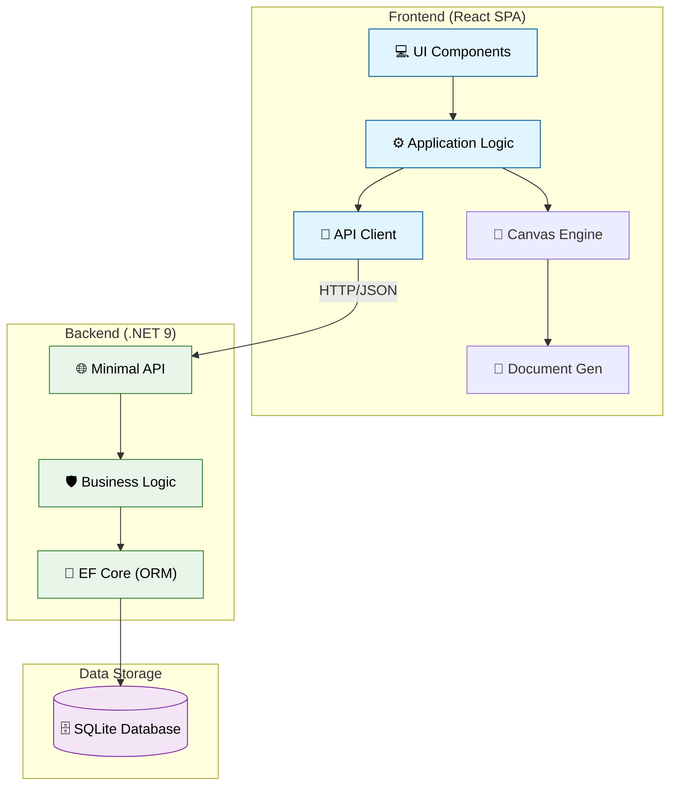

# Auto-Cert - Generator Certyfikatów 🎓

Nowoczesna aplikacja do generowania certyfikatów z podglądem na żywo, eksportem do ZIP i zarządzaniem uczestnikami.

---

## 🚀 Quick Start

```bash
# Instalacja
yarn

# Uruchomienie
yarn dev

# Otwórz http://localhost:5173
```

---

## ✨ Funkcje

### 📊 Dashboard

- **Statystyki na żywo** - liczba uczestników, średni wynik, szablony
- **Szybkie akcje** - natychmiastowy dostęp do wszystkich funkcji
- **Ostatnia aktywność** - historia importów i generowania
- **Nowoczesny design** - gradient, animacje, kolorowe karty

### 📥 Import Uczestników

- **Drag & drop** CSV
- **Prosty parser** - automatyczne wykrywanie nagłówków
- **Podgląd przed importem** - zobacz dane w tabeli
- **5 kolumn** - Imię, Email, Firma, Wynik, Data

### 👥 Zarządzanie Uczestnikami

- **Tabela** - wszystkie dane w jednym miejscu
- **Edycja inline** - kliknij i edytuj
- **Wyszukiwarka** - szybkie filtrowanie
- **Dodawanie/usuwanie** - pełne CRUD
- **Auto-zapis** - localStorage

### 🎨 Wybór Szablonów

- **3 szablony domyślne** - Klasyczny, Nowoczesny, Minimalistyczny
- **Galeria kart** - podgląd miniatur
- **Kategorie** - Business, Education, Sport
- **Wsparcie dla własnych** - localStorage

### 🖼️ Generator z Podglądem

- **Canvas rendering** - podgląd na żywo
- **Nawigacja** - przeglądaj wszystkich uczestników
- **Edytor tekstu:**
  - Rozmiar czcionki (20-100px)
  - Wybór czcionki (6 opcji)
  - Kolor tekstu (picker + hex)
  - Pozycja X/Y (slidery)
- **Pobieranie pojedyncze** - PNG
- **Pobieranie wszystkich** - sekwencyjne

### 📦 Eksport do ZIP

- **JSZip** - automatyczne pakowanie
- **Pasek postępu** - 0-100%
- **Nazwa pliku** - certyfikat_Imie_Nazwisko.png
- **Auto-download** - certyfikaty_2024-11-13.zip

---

## 🎯 Workflow

1. **Importuj uczestników** → CSV z drag & drop
2. **Wybierz szablon** → Galeria 3 szablonów
3. **Generuj certyfikaty** → Podgląd + edycja tekstu
4. **Eksportuj ZIP** → Wszystkie certyfikaty w archiwum

**Czytaj wskazówki**

- Skróty klawiszowe (Ctrl+D)
- Porady dotyczące szablonów
- Informacje o funkcjach zaawansowanych

---

## 🏗️ Architektura

Aplikacja działa w modelu Monorepo Klient-Serwer:



---

## 📋 Wymagania

- Nowoczesna przeglądarka (Chrome, Firefox, Edge, Safari)
- Włączona obsługa JavaScript
- Minimum 2GB RAM
- Rozdzielczość ekranu min. 1280x720px (zalecane)

## 🛠️ Instalacja i Uruchomienie

### Wymagania
- **Node.js 18+**
- **Yarn**
- **.NET 9.0 SDK**

```bash
# Klonowanie repozytorium
git clone https://github.com/gorakuba/auto-cert.git
cd auto-cert

# Instalacja zależności (wspólna dla frontend)
yarn

# Uruchomienie w trybie deweloperskim (Frontend + Backend)
# Uruchamia:
# - Frontend: http://localhost:5173
# - Backend: http://localhost:5050 (Swagger: /swagger)
yarn dev

# Budowanie wersji produkcyjnej
yarn web-app:build
dotnet build apps/backend/AutoCert.Backend

# Uruchomienie przez Docker (Produkcja)
docker-compose up --build
```

## 📦 Technologie

### Frontend (`apps/web-app`)
- **React 19**
- **TypeScript 5.8**
- **Tailwind CSS 4.0**
- **Vite 6**
- **Playwright** (E2E)

### Backend (`apps/backend`)
- **.NET 9 (ASP.NET Core Minimal APIs)**
- **Entity Framework Core**
- **SQLite**
- **Swagger/OpenAPI**

## 📁 Struktura Projektu (Monorepo)

```
auto-cert/
├── apps/
│   ├── web-app/                  # Frontend (React + Vite)
│   │   ├── src/
│   │   ├── e2e/             # Testy E2E (Playwright)
│   │   └── package.json
│   └── backend/                  # Backend (.NET)
│       ├── AutoCert.Backend/
│       ├── AutoCert.Tests/
│       └── AutoCert.Backend.sln
├── package.json              # Root (Yarn Workspaces)
└── README.md
```

## 💾 Przechowywanie Danych

Dane są przechowywane w lokalnej bazie danych **SQLite** (`auto-cert.db`) obsługiwanej przez backend .NET.

- **Uczestnicy**: Tabela `Participants`
- **Ustawienia**: Tabela `Settings` (status tutoriala, wybrany szablon)
- **Historia**: Przechowywana w bazie

Frontend komunikuje się z bazą poprzez REST API (`/api/participants`, `/api/settings`).

## 🎨 Customizacja

### Zmiana kolorów

W `Dashboard.tsx` zmień kolory kart:

```tsx
<StatCard color="border-blue-500" />  // niebieski
<StatCard color="border-green-500" /> // zielony
<StatCard color="border-purple-500" /> // fioletowy
```

### Dodanie szablonu

Umieść plik SVG/PNG w `public/templates/` i dodaj w `TemplateSelector.tsx`:

```tsx
{
  id: 't4',
  name: 'Mój Szablon',
  thumbnail: '/templates/template4.svg',
  path: '/templates/template4.svg',
  description: 'Opis szablonu',
  category: 'custom',
}
```

## 🤝 Współpraca

Chcesz wnieść wkład? Świetnie!

1. Forkuj repozytorium
2. Stwórz branch funkcji (`git checkout -b feature/NazwaFunkcji`)
3. Commituj zmiany (`git commit -m 'Dodaj nową funkcję'`)
4. Push do brancha (`git push origin feature/NazwaFunkcji`)
5. Otwórz Pull Request

## 📄 Licencja

Projekt prywatny - **Kuba Góra**

## 👨‍💻 Autor

**Kuba Góra** - [@gorakuba](https://github.com/gorakuba)
